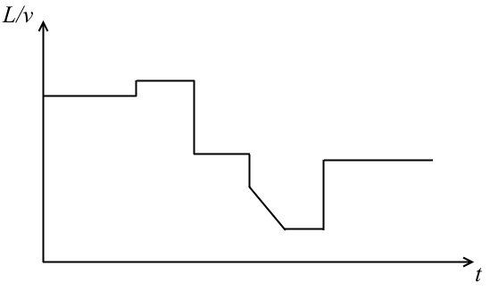

# DAFX-Tape
Supplementary material for the paper 'Efficient emulation of tape-like delay modulation behavior'

The 4 wavefiles __dly\_test\_a.wav ... dly\_test\_d.wav__ contain the recordings of the output of a feedback delay with the delay core being implemented with algorithms __(a) ... (d)__, as introduced in the __Results__ section of the paper. The recordings are done for a short piece of a lowpass-filtered sawtooth appearing at the delay input and then modulating the equivalent tape speed according to the automation curve below (which plots the steady-state delay time $`L/v`$ against time $`t`$).

The curve demonstrates speedup/slowdown jumps in tape speed as well as a gradual change of the tape speed.